# RRoulette — パネルセクション詳細ガイド

各パネルの折りたたみグループ / セクションを展開した状態のキャプチャと、各 UI 要素の説明を掲載しています。

---

## 目次

- [メインウィンドウ](#メインウィンドウ)
- [ルーレットパネル](#ルーレットパネル)
- [管理パネル（F1）](#管理パネルf1)
  - [パネル管理](#パネル管理)
  - [ルーレット管理](#ルーレット管理)
  - [ルーレット以外非表示時](#ルーレット以外非表示時)
  - [アプリ設定](#アプリ設定)
  - [ウィンドウ表示](#アプリ設定--ウィンドウ表示)
  - [OCR](#アプリ設定--ocr)
  - [テーマ・動作](#アプリ設定--テーマ動作)
  - [音量](#アプリ設定--音量)
  - [リプレイ](#アプリ設定--リプレイ)
  - [自動全面非表示](#アプリ設定--自動全面非表示)
  - [外部連携](#アプリ設定--外部連携)
- [項目パネル（F2）](#項目パネルf2)
  - [パターン](#パターン)
  - [項目リスト](#項目リスト)
- [設定パネル（F3）](#設定パネルf3)
  - [スピン](#スピン)
  - [スピン詳細（4段階個別調整）](#スピン--スピン詳細4段階個別調整)
  - [表示](#表示)
  - [デザイン](#デザイン)
  - [結果表示](#結果表示)
  - [サウンド](#サウンド)
  - [ログ](#ログ)
  - [リプレイ](#リプレイ)
  - [特殊演出（テスト版）](#特殊演出テスト版)
  - [音系](#特殊演出テスト版--音系)
  - [ミニキャラ系](#特殊演出テスト版--ミニキャラ系)
  - [カットイン系](#特殊演出テスト版--カットイン系)
  - [その他](#特殊演出テスト版--その他)
- [実行パネル（F5）](#実行パネルf5)
- [チケットパネル（F4）](#チケットパネルf4)
- [連携パネル（F6）](#連携パネルf6)
- [キーボードショートカット](#キーボードショートカット)

---

## メインウィンドウ

RRoulette のメインウィンドウは、アプリ全体の土台となるコンテナです。
ルーレットパネル（回転する抽選ホイール）と項目パネルをデフォルトで内包し、各種フローティングパネル（管理・設定・チケット・実行・連携）の親ウィンドウとしても機能します。

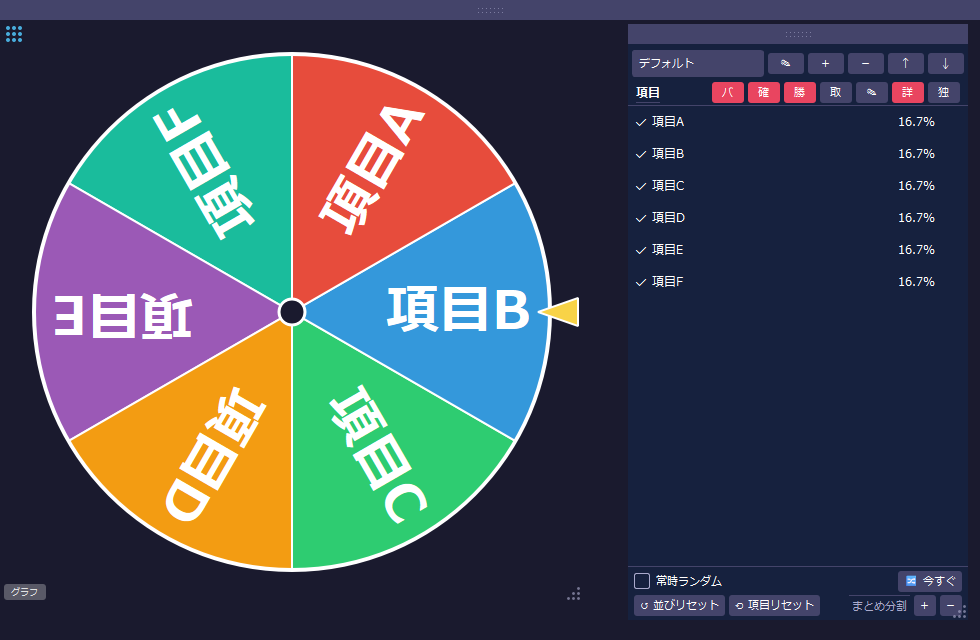

| 領域 | 説明 |
|------|------|
| 左：ルーレットパネル | セグメントを回転して抽選を行うホイール。ポインターが指した項目が結果になる |
| 右：項目パネル | 抽選対象の項目一覧。デフォルトでドッキングしているが、独立ウィンドウとして切り離せる |
| 上部ドラッグバー（点線） | ドラッグでウィンドウを移動できる |
| 左下「グラフ」ボタン | 当選履歴グラフを表示する |
| 右下グリップ | ドラッグでウィンドウをリサイズできる |

フローティングパネルは **F1〜F6** キーで個別に表示 / 非表示を切り替えられます。
管理パネル（F1）の「パネル管理」セクションで全パネルの表示状態を一括確認できます。

---

## ルーレットパネル

ルーレットパネルはメインウィンドウに内包されている抽選ホイールです。
スピンボタンのクリック・右クリックメニューからスピンを開始でき、停止時のポインター位置で当選項目が決定されます。
マルチルーレット時は複数のルーレットパネルが並んで表示されます。

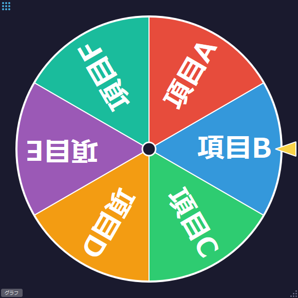

| 要素 | 説明 |
|------|------|
| ホイール | 各項目のセグメントを並べた回転する円盤。クリックまたは右クリックメニューでスピン開始 |
| ポインター | ホイール上で当選セグメントを指す矢印。ドラッグで位置を調整できる |
| 選択ハンドル（左上 3×3 ドット） | クリックでルーレットをアクティブに切り替える（マルチルーレット時） |
| タイトルプレート | ルーレット名を表示する（マルチルーレット時のみ） |
| 「グラフ」ボタン（左下） | クリックで当選履歴グラフウィンドウを開く |
| リサイズグリップ（右下） | ドラッグでルーレットパネルのサイズを変更する |
| 結果オーバーレイ | スピン停止後に当選項目名を大きく表示する |
| ログオーバーレイ | 直近の抽選ログをルーレット上に重ねて表示する（設定パネル > ログ で有効化） |

---

## 管理パネル（F1）

管理パネルは **F1** キーで表示 / 非表示を切り替えられます。
4 つのグループで構成されており、各グループのヘッダーボタン（▼/▶）で折りたたみができます。
ヘッダー右端の **「独」** ボタンで管理パネルをメインウィンドウから切り離した独立ウィンドウとして配置できます。
各サブグループの **「初期化」** ボタンでそのグループの設定をデフォルト値に戻せます。

### パネル管理

各パネルの表示 / 非表示を切り替えます。

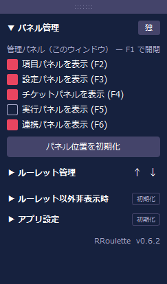

| 表示ラベル | 説明 |
|-----------|------|
| `管理パネル（このウィンドウ） — F1 で開閉` | F1 キーで開閉できることを示す |
| `項目パネルを表示 (F2)` | 項目パネルの表示 / 非表示 |
| `設定パネルを表示 (F3)` | 設定パネルの表示 / 非表示 |
| `チケットパネルを表示 (F4)` | チケットパネルの表示 / 非表示 |
| `実行パネルを表示 (F5)` | 被りなし連続抽選パネルの表示 / 非表示 |
| `連携パネルを表示 (F6)` | 外部連携パネルの表示 / 非表示 |
| `パネル位置を初期化` | 全パネルの位置をデフォルト配置に戻す |

### ルーレット管理

複数のルーレットを管理します（マルチルーレット）。ルーレットごとに項目リスト・設定・ログが独立して保持されます。アクティブなルーレットがルーレット本体に表示されスピン対象となります。

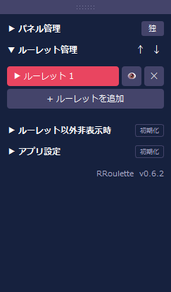

| 表示ラベル | 説明 |
|-----------|------|
| `↑` | 選択中のルーレットデータをファイルに書き出す |
| `↓` | ファイルからルーレットデータを読み込んで追加する |
| `▶ ルーレット名` | ▶ マーク付きが現在アクティブ。クリックで切り替え、ダブルクリックで名称変更 |
| `👁 / 🚫` | そのルーレットの表示 / 非表示を切り替える |
| `✕` | そのルーレットを削除する（1つのみの場合は無効） |
| `+ ルーレットを追加` | 新しいルーレットを追加する |

### ルーレット以外非表示時

「ルーレット以外非表示」モード中に表示したままにするUI要素を個別に設定します。

**パネル**サブグループ: モード中も表示するパネルを選択します。
**ルーレットパネル**サブグループ: ルーレット本体内で表示を維持する要素を選択します。

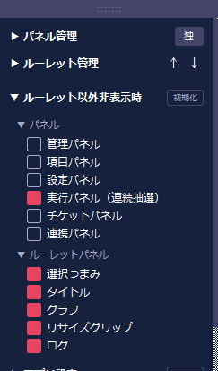

| 表示ラベル | 説明 |
|-----------|------|
| `管理パネル` | 非表示モード中も管理パネルを表示 |
| `項目パネル` | 非表示モード中も項目パネルを表示 |
| `設定パネル` | 非表示モード中も設定パネルを表示 |
| `実行パネル（連続抽選）` | 非表示モード中も連続抽選パネルを表示 |
| `チケットパネル` | 非表示モード中もチケットパネルを表示 |
| `連携パネル` | 非表示モード中も連携パネルを表示 |
| `選択つまみ` | 非表示モード中も選択つまみを表示 |
| `タイトル` | 非表示モード中もタイトルプレートを表示 |
| `グラフ` | 非表示モード中もスピンボタン（グラフ）を表示 |
| `リサイズグリップ` | 非表示モード中もリサイズグリップを表示 |
| `ログ` | 非表示モード中もログ表示を表示 |

### アプリ設定

アプリ全体に関わる設定グループです。7 つのサブグループを持ちます。

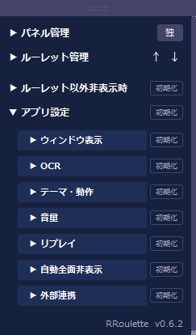

| 表示ラベル | 説明 |
|-----------|------|
| `ウィンドウ表示` | ウィンドウの透過・最前面設定 |
| `OCR` | OCR 取り込みのキャプチャ方式 |
| `テーマ・動作` | UIテーマと操作確認ダイアログ |
| `音量` | スピン音・決定音・演出音の音量 |
| `リプレイ` | リプレイの保存上限と動作 |
| `自動全面非表示` | 一定時間操作なしで自動的に全面非表示にする設定 |
| `外部連携` | 外部ツール（RCommentHub）との連携受信設定 |

### アプリ設定 > ウィンドウ表示

ウィンドウの透過と最前面表示を設定します。

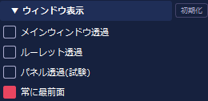

| 表示ラベル | 説明 |
|-----------|------|
| `メインウィンドウ透過` | メインウィンドウの背景を透明にする |
| `ルーレット透過` | ルーレット部分のみ背景を透明にする |
| `パネル透過(試験)` | 各パネルの背景を透明にする（試験的機能） |
| `常に最前面` | アプリウィンドウを常に他のウィンドウより前面に表示する |

### アプリ設定 > OCR

項目パネルの「取」ボタンで使う画面キャプチャの方式を選択します。

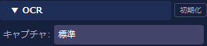

| 表示ラベル | 説明 |
|-----------|------|
| `キャプチャ:` | 標準（Qt）: 通常はこちら。Windows GDI: 一部のゲームや画面で取り込めない場合に切り替えると改善することがある |

### アプリ設定 > テーマ・動作

UIテーマと操作確認ダイアログの有無を設定します。

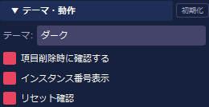

| 表示ラベル | 説明 |
|-----------|------|
| `テーマ:` | UIの配色テーマを選択する（ダーク / ライト / システム） |
| `項目削除時に確認する` | 項目削除時に確認ダイアログを表示する |
| `インスタンス番号表示` | 複数起動時に各ウィンドウのインスタンス番号を表示する |
| `リセット確認` | 設定リセット操作時に確認ダイアログを表示する |

### アプリ設定 > 音量

効果音の種類ごとに音量を個別調整します。

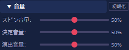

| 表示ラベル | 説明 |
|-----------|------|
| `スピン音量:` | ルーレット回転中に流れるスピン音の音量（0〜100%） |
| `決定音量:` | 抽選結果確定時に流れる決定音の音量（0〜100%） |
| `演出音量:` | 特殊演出発動時に流れる演出音の音量（0〜100%） |

### アプリ設定 > リプレイ

スピンのリプレイ保存に関する設定です。

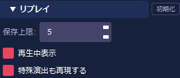

| 表示ラベル | 説明 |
|-----------|------|
| `保存上限:` | リプレイの最大保存件数（1〜20件）。上限に達すると古いものから削除される |
| `再生中表示` | リプレイ再生中であることを示す表示を出す |
| `特殊演出も再現する` | ON: 演出もリプレイに記録して再生時に再現する。OFF: 角度フレームのみ再現 |

### アプリ設定 > 自動全面非表示

一定時間操作がない場合にアプリ全体を自動で非表示にする機能の設定です。

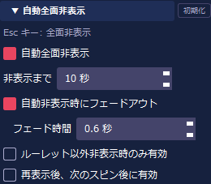

| 表示ラベル | 説明 |
|-----------|------|
| `Esc キー: 全面非表示` | Esc キーで手動全面非表示にできることを示す |
| `自動全面非表示` | 機能全体の ON / OFF |
| `非表示まで` | 操作なしが続いてから非表示になるまでの秒数（1〜300） |
| `自動非表示時にフェードアウト` | 非表示時にフェードアウトアニメーションを使用する |
| `フェード時間` | フェードアウトにかける時間（0.1〜10.0秒） |
| `ルーレット以外非表示時のみ有効` | 「ルーレット以外非表示」モード中のみ有効にする |
| `再表示後、次のスピン後に有効` | 再表示後、次のスピン完了後からタイマーを再開する |

### アプリ設定 > 外部連携

外部ツール（RCommentHub 等）からのメッセージ受信に関する設定です。

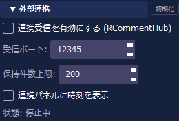

| 表示ラベル | 説明 |
|-----------|------|
| `連携受信を有効にする (RCommentHub)` | 外部ツールからのメッセージ受信を有効にする |
| `受信ポート:` | 外部ツールが接続するローカルポート番号（1024〜65535） |
| `保持件数上限:` | 受信メッセージのキュー保持上限件数（1〜1000件） |
| `連携パネルに時刻を表示` | 連携パネルの受信メッセージ一覧に時刻列を表示する |
| `状態:` | 連携受信サーバーの動作状態（停止中 / 受信中 / エラー）を表示する |

---

## 項目パネル（F2）

項目パネルは **F2** キーで表示 / 非表示を切り替えられます。
「パターン」と「項目リスト」の 2 セクションで構成されており、項目の登録・管理や OCR 取り込みを行います。

### パターン

現在の項目リストをパターン（プリセット）として保存・切り替えします。

| 表示ラベル | 説明 |
|-----------|------|
| `(パターン名)` | 保存済みパターンの一覧。クリックで選択・切り替え |
| `✎` | 選択中のパターン名を変更する |
| `＋` | 現在の項目リストを新しいパターンとして保存する |
| `－` | 選択中のパターンを削除する |
| `↑` | 選択中のパターンをファイルに書き出す |
| `↓` | ファイルからパターンを読み込んで追加する |

### 項目リスト

抽選候補となる項目を管理します。

#### タイトルバー（共通）

| 表示ラベル | 説明 |
|-----------|------|
| `バ` | バッジ列（確率モード・分割数・役割）の表示 / 非表示 |
| `確` | 確率列の表示 / 非表示 |
| `勝` | 当選回数列の表示 / 非表示 |
| `取` | 画面範囲を選択して OCR でテキストを取り込む |
| `✎` | テキスト一括編集モードに切り替える（1行 1項目で直接編集） |
| `シ` / `詳` | シンプル表示 / 詳細表示を切り替える |
| `独` | 項目パネルを独立ウィンドウにする |

#### シンプル表示

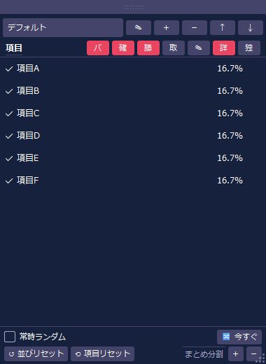

1行 1項目のコンパクトな一覧表示です。
各項目行の構成：

| 表示ラベル | 説明 |
|-----------|------|
| チェックボックス | ON/OFF で抽選対象に含める / 除外を切り替える |
| 項目名 | 抽選に表示されるテキスト。**ダブルクリックで項目名をその場で直接編集**できる |
| バッジ | `固10%` `÷2` `⭐` などの設定概要。`バ` 列表示 ON 時に表示 |
| 確率 | 現在の選出確率（%）。`確` 列表示 ON 時に表示 |
| 当選回数 | その項目の当選回数。`勝` 列表示 ON 時に表示 |

項目をクリックで選択すると一覧の下部に編集エリアが展開されます：

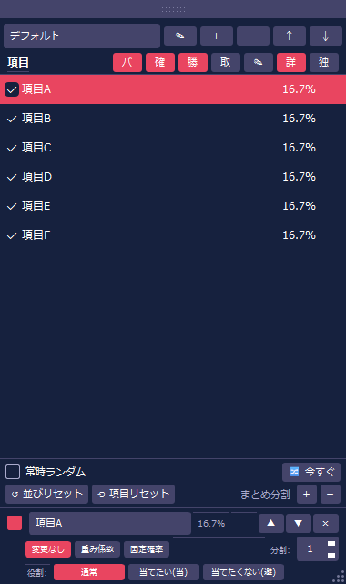

| 表示ラベル | 説明 |
|-----------|------|
| チェックボックス | ON/OFF で抽選対象に含める / 除外を切り替える |
| 項目名入力欄 | 項目名を編集する（入力内容はリアルタイムに反映） |
| 確率（読み取り専用） | 現在の選出確率（%） |
| 当選回数（読み取り専用） | その項目の当選回数 |
| `▲` / `▼` | 項目の並び順を上下に移動する |
| `×` | その項目を削除する |
| `変更なし` / `重み係数` / `固定確率` | 確率設定のモードを選択する |
| `分割:` スピンボックス | 1項目を複数セグメントとして表示する分割数（1〜10） |
| `役割:` `通常` / `当てたい(当)` / `当てたくない(避)` | **特殊演出**で使う役割。演出システムがこのフラグを参照し、「当てたい」項目に対してはより演出を発動しやすくするなどの制御に使われる |

#### 詳細表示

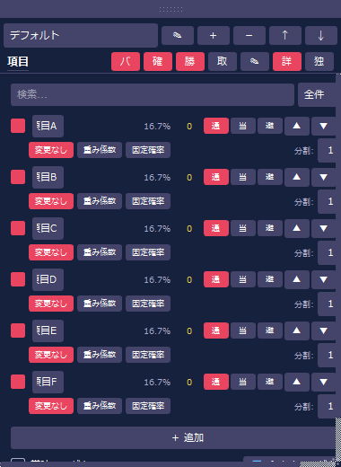

各項目行に確率モード・分割数・役割などのコントロールが**常時展開**されます（`詳` ボタンで切り替え）。
シンプル表示と異なり、項目を選択しなくても各行のコントロールを直接操作できます。
各行の構成はシンプル表示の編集エリアと同じですが、行右端の操作ボタン（`▲` / `▼` / `×`）も常時表示されます。

#### 操作ボタン（共通）

シンプル表示・詳細表示の両方で、一覧の下部に常時表示される操作ボタンです。

| 表示ラベル | 説明 |
|-----------|------|
| `常時ランダム` | スピンのたびに項目配置を自動でランダム化する |
| `🔀 今すぐ` | 今すぐ項目配置をランダム化する（1回だけ） |
| `↺ 並びリセット` | 項目の並び順を元の順序に戻す |
| `⟲ 項目リセット` | 全項目の確率・分割数・役割などの設定を初期値に戻す |
| `まとめ分割 ＋` / `－` | 表示中の全項目の分割数を一括で 1 増やす / 減らす（最小 1） |

---

## 設定パネル（F3）

設定パネルは **F3** キーで表示 / 非表示を切り替えられます。
スピン・表示・デザイン・サウンド・ログ・リプレイ・特殊演出などの各セクションに分かれており、各セクションヘッダーの ▼/▶ ボタンで折りたたみができます。

### スピン

スピン動作のプロファイルと時間パラメータを調整します。

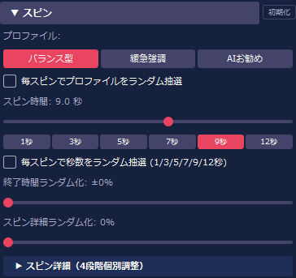

| 表示ラベル | 説明 |
|-----------|------|
| `バランス型 / 緩急強調 / AIお勧め` | スピン動作のプリセットプロファイルを選択する |
| `毎スピンでプロファイルをランダム抽選` | スピンごとにプロファイルをランダムに変える |
| `スピン時間:` | 1回のスピンの基準時間（1.0〜15.0秒） |
| `[1秒] [3秒] [5秒] [7秒] [9秒] [12秒]` | スピン時間をワンクリックで設定する |
| `毎スピンで秒数をランダム抽選` | スピンごとに上記プリセット値からランダムに秒数を選ぶ |
| `終了時間ランダム化:` | 停止タイミングにランダムなバラつきを加える（0〜50%） |
| `スピン詳細ランダム化:` | スピン詳細（4段階）のパラメータにランダム変動を加える（0〜100%） |

### スピン > スピン詳細（4段階個別調整）

スピン動作を①加速・②巡航・③減速・④着地の 4 フェーズに分けて細かく調整します。

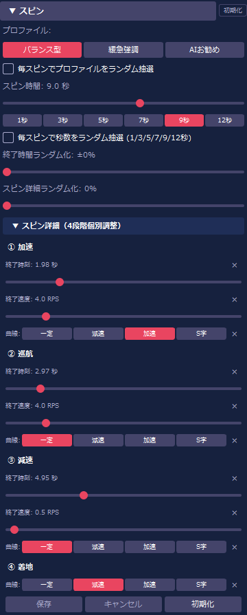

| 表示ラベル | 説明 |
|-----------|------|
| `① 加速 / ② 巡航 / ③ 減速 / ④ 着地` | 各フェーズのパラメータを個別に設定する |
| `終了時刻:` | そのフェーズが終了する時刻（スピン開始からの秒数） |
| `終了速度:` | そのフェーズ終了時点の回転速度（RPS） |
| `[一定] [減速] [加速] [S字]` | そのフェーズ内の速度変化カーブを選択する |
| `保存 / キャンセル / 初期化` | 保存: 設定を確定。キャンセル: 変更を破棄。初期化: 全フェーズをデフォルトに戻す |

### 表示

ルーレット本体の見た目と表示方法を調整します。

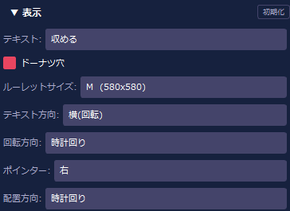

| 表示ラベル | 説明 |
|-----------|------|
| `テキスト:` | 項目テキストがはみ出した際の扱いを選択する（省略 / 収める / 縮小） |
| `ドーナツ穴` | ルーレット中央を穴抜き（ドーナツ型）にする |
| `ルーレットサイズ:` | アクティブなルーレットパネルのサイズプリセットを選択する |
| `テキスト方向:` | 項目テキストの向きを選択する（横(回転) / 横(水平) / 縦上 / 縦下 / 縦直立） |
| `回転方向:` | ルーレットの回転方向を選択する（反時計回り / 時計回り） |
| `ポインター:` | 当選を示すポインターの位置プリセットを選択する |
| `配置方向:` | 項目をルーレット上に並べる方向を選択する（時計回り / 反時計回り） |

### デザイン

デザインエディタで色・フォント・セグメントカラーを編集します。

| 表示ラベル | 説明 |
|-----------|------|
| `デザインエディタを開く` | 色・フォント・セグメントカラーを編集する専用ウィンドウを起動する |

### 結果表示

抽選結果テキストの閉じ方・保持時間を設定します。

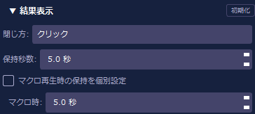

| 表示ラベル | 説明 |
|-----------|------|
| `閉じ方:` | 結果テキストを閉じる方法を選択する（クリック / 自動 / 両方） |
| `保持秒数:` | 結果テキストを表示し続ける時間（0.5〜30.0 秒） |
| `マクロ再生時の保持を個別設定` | マクロ（連続スピン）再生時の保持秒数を別途設定する |
| `マクロ時:` | マクロ再生時の保持秒数（0.5〜30.0 秒）。上記チェック ON 時に有効 |

### サウンド

スピン音・決定音の有効 / 無効とパターンを設定します。

各音の右端にある `📁` でカスタム音声ファイルを選択できます。`♪` でその場でテスト再生できます（スピン音・決定音 共通）。

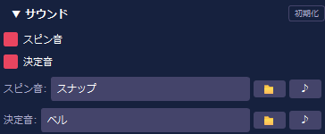

| 表示ラベル | 説明 |
|-----------|------|
| `スピン音` | スピン音の ON / OFF |
| `スピン音:` | 回転中に流れる効果音パターンを選択する |
| `決定音` | 決定音の ON / OFF |
| `決定音:` | 結果確定時に流れる効果音パターンを選択する |

### ログ

ルーレット本体上のログ表示とログデータの管理を設定します。

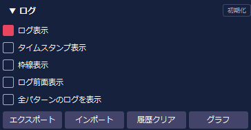

| 表示ラベル | 説明 |
|-----------|------|
| `ログ表示` | ルーレット本体上のログ表示の ON / OFF |
| `タイムスタンプ表示` | ログに時刻を表示する |
| `枠線表示` | ログ表示エリアに枠線を表示する |
| `ログ前面表示` | ログ表示エリアを常に前面に表示する |
| `全パターンのログを表示` | ON: 全パターンのログを表示。OFF（既定）: 選択中パターンのみ |
| `エクスポート` | ログデータをファイルに書き出す |
| `インポート` | ファイルからログデータを読み込む |
| `履歴クリア` | ログ履歴をすべて削除する |
| `グラフ` | 当選回数のグラフを表示する |

### リプレイ

スピンのリプレイを管理・再生します。

| 表示ラベル | 説明 |
|-----------|------|
| `記録: N件` | 保存されているリプレイの件数を表示する |
| `最新を再生` | 最新のリプレイを再生する |
| `中断` | 再生中のリプレイを中断する |
| `管理...` | リプレイ一覧ウィンドウを開く（再生・削除・名称変更・書き出し・読み込み） |

### 特殊演出（テスト版）

スピン中・停止時に発生する特殊演出の全体設定です。

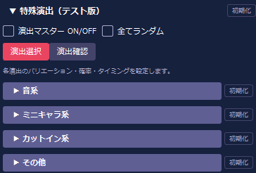

| 表示ラベル | 説明 |
|-----------|------|
| `演出マスター ON/OFF` | 特殊演出機能全体の ON / OFF |
| `全てランダム` | スピンごとに、ON の演出の中から1つをランダムに選び、その演出パターン・発生確率・タイミングもすべてランダムで抽選する |
| `演出選択` | 各演出の演出パターン・発生確率・タイミングを設定するモードに切り替える |
| `演出確認` | 演出をその場で試聴 / 視聴するモードに切り替える |

サブグループ（音系 / ミニキャラ系 / カットイン系 / その他）の各ヘッダーで折りたたみができます。
各サブグループ右端の `初期化` ボタンでそのカテゴリの設定をデフォルト値に戻せます。

### 特殊演出（テスト版） > 音系

音に関連した特殊演出の設定です。**ミニキャラ系・カットイン系・その他も同じ構成**です。

#### 演出選択モード

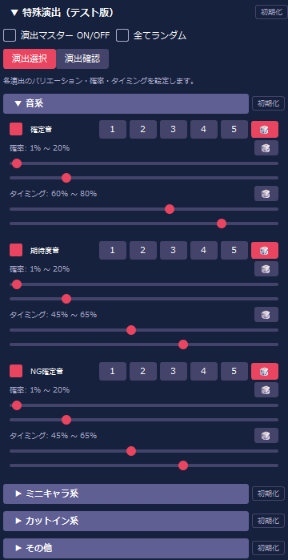

各演出行の構成：

| 表示ラベル | 説明 |
|-----------|------|
| チェックボックス + 演出名 | その演出の ON / OFF |
| `1` `2` `3` `4` `5` `🎲` | 演出パターン番号を選択する（`🎲` はスピンごとにランダム選択） |
| `確率:` スライダー×2 + `🎲` | 演出が発動する確率の範囲（最小〜最大 %）。`🎲` で毎スピン 0〜100% から完全ランダム |
| `タイミング:` スライダー×2 + `🎲` | スピン中に演出が発動するタイミングの範囲（%）。`🎲` で完全ランダム |

#### 演出確認モード

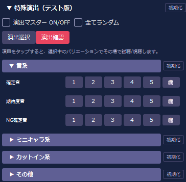

| 表示ラベル | 説明 |
|-----------|------|
| 演出名 + `1` `2` `3` `4` `5` `🎲` | 各ボタンをクリックするとその演出パターンをその場で試聴 / 視聴する |

### 特殊演出（テスト版） > ミニキャラ系

ミニキャラが登場する特殊演出の設定です。構成・操作方法は「音系」と同じです。

### 特殊演出（テスト版） > カットイン系

カットインアニメーションの特殊演出設定です。構成・操作方法は「音系」と同じです。

### 特殊演出（テスト版） > その他

フラッシュ・発光・テキストなどの特殊演出設定です。構成・操作方法は「音系」と同じです。

---

## 実行パネル（F5）

**F5** キーで表示 / 非表示を切り替えます。

同じ項目を連続して選ばないよう制御しながら、指定回数の抽選を自動で進行するパネルです（被りなし連続抽選）。
右クリックメニューの「被りなし連続抽選...」からも開けます。

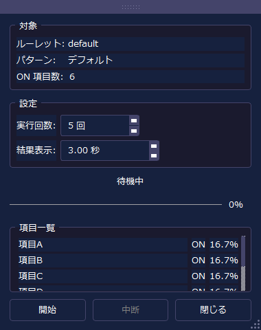

### 対象

| 表示ラベル | 説明 |
|-----------|------|
| `ルーレット:` | 抽選対象のルーレット名 |
| `パターン:` | 使用中のパターン名 |
| `ON 項目数:` | 現在 ON になっている項目数 |

### 設定

| 表示ラベル | 説明 |
|-----------|------|
| `実行回数:` | 連続抽選を行う回数（1〜ON項目数 − 1）。全項目数を指定すると一巡で全項目に当選するため選択不可 |
| `結果表示:` | 1回のスピン後に結果を表示し続ける時間（0.5〜30.0 秒） |

### 項目一覧

現在 ON の項目を一覧表示します。各行に名前・状態（`ON` → `✓` 当選済 → `OFF`）・確率が表示され、進行に伴ってリアルタイムに更新されます。

### 操作ボタン

| ボタン | 説明 |
|--------|------|
| `開始` | 設定した回数の連続抽選を開始する |
| `中断` | 実行中の連続抽選を途中で停止する |
| `閉じる` | パネルを閉じる |

---

## チケットパネル（F4）

**F4** キーで表示 / 非表示を切り替えます。

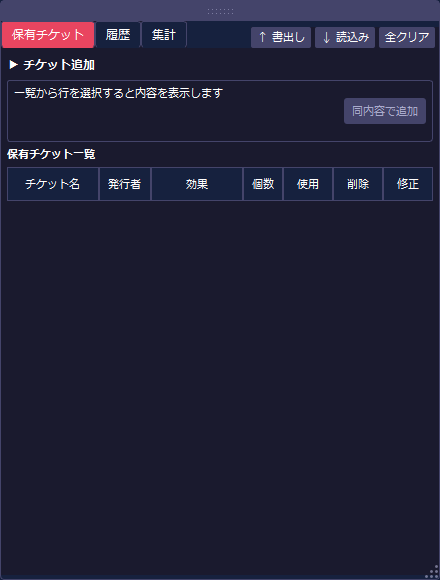

### タブ構成

| タブ | 内容 |
|------|------|
| **保有チケット** | チケットの追加フォームと保有チケット一覧 |
| **履歴** | チケットの使用・削除履歴（ダブルクリックで復活） |
| **集計** | チケット名 / 発行者 / 効果ごとの集計表 |

### チケットの追加

「チケット追加」フォームで以下を設定して追加します：

| 項目 | 説明 |
|------|------|
| チケット名 | チケットの名称 |
| 発行者 | 誰が発行したか（任意） |
| 効果 | なし / ポインター移動 / 項目非表示 / 重み係数指定 / 固定確率指定 / 追加確率指定 |
| 個数 | 追加する枚数 |

### 保有チケット一覧

チケット名・発行者・効果・個数を一覧表示します。
「使用」ボタンでチケット効果を適用、「削除」で廃棄、「修正」で内容を編集できます。

---

## 連携パネル（F6）

**F6** キーで表示 / 非表示を切り替えます。

外部ツールから受信したメッセージを解析・実行するパネルです。

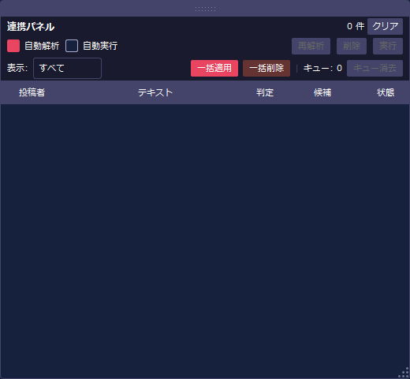

### 上部コントロール

| 要素 | 説明 |
|------|------|
| 自動解析（赤） | ON のとき、受信メッセージをスピン / チケット追加 / 不明に自動判定 |
| 自動実行 | ON のとき、判定結果を自動で実行する |
| 再解析 | 選択中のメッセージを再解析 |
| 削除 | 選択中のメッセージを削除 |
| 実行 | 選択中のメッセージを手動実行 |
| 一括適用 | フィルター対象をすべて実行 |
| 一括削除 | フィルター対象をすべて削除 |
| キュー: 0 | 待機中のスピンキュー件数 |
| キュー消去 | スピンキューを空にする |

### 表示フィルター

「すべて」「未処理」「適用済」「未適用」「判定不能」「spin」「ticket_add」で絞り込みができます。

### メッセージ一覧

受信したメッセージを「投稿者 / テキスト / 判定 / 候補 / 状態」列で表示します。

---

## キーボードショートカット

| キー | 機能 |
|------|------|
| F1 | 管理パネルの表示 / 非表示 |
| F2 | 項目パネルの表示 / 非表示 |
| F3 | 設定パネルの表示 / 非表示 |
| F4 | チケットパネルの表示 / 非表示 |
| F5 | 実行パネル（被りなし連続抽選）の表示 / 非表示 |
| F6 | 連携パネルの表示 / 非表示 |
| Esc | 全面非表示（全パネル・ルーレットを一時非表示） |
| Tab | ルーレット以外非表示モードの切り替え（右クリックメニューからも可） |
